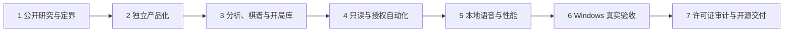

# PikaDesk

**把中国象棋分析、棋谱研究、多引擎比较和授权棋盘实验，放回一台真正由你掌控的电脑。**

[](LICENSE)
[](docs/development.md)
[](docs/release-readiness.md)
[](CHANGELOG.md)

PikaDesk 是一个完全免费、本地优先的中国象棋桌面工作台。它把局面分析、五引擎并行、分支棋谱、开局库、多格式读写、只读实时陪练和经过授权的本地棋盘自动化，组织成一套可运行、可测试、可审计的工程系统。

项目不把“界面能打开”当作完成，也不靠模糊的功能清单证明能力。每项关键工作流都必须落到明确状态机、失败闭锁、资源上限、自动化测试和真实 Windows 验收；证据不足的兼容性或发布条件，会被明确标记为未完成。

> PikaDesk 是独立社区项目。它不是鲨鱼、TCHESS 或 Pikafish 的官方产品，也未获得这些项目或产品的背书。上游代码、引擎、模型、字体和棋谱样例分别遵守各自许可证与使用条件。

## 项目声明：独立工程，不是闭源软件改壳

PikaDesk 的产品定义、工程架构、安全边界、测试体系、Windows 打包链、本地资源装配、开局库处理、多引擎工作区、分支棋谱、只读陪练、授权自动化闭环和本地语音，均由本项目独立设计、编码、验证和维护。它不修改、不注入、不调用鲨鱼等商业产品的私有逻辑，也不提供授权绕过。

同时，我们不会把“独立维护”误写成“无任何上游”。当前代码树承接了 TCHESS 的 GPL v3 代码与资源基线，因此法律上是衍生作品；Pikafish 是通过公开 UCI/UCCI 协议接入的独立引擎，而非本仓库复制的引擎实现。这种边界既尊重上游，也让 PikaDesk 对自己的新增实现、验证标准和长期维护负责。

## 为什么需要 PikaDesk

传统象棋工具常把引擎、棋谱、识别、自动输入和平台连接混在一起：用户不知道数据是否离开本机，也难以判断一次自动落子为何成功或失败。PikaDesk 把这些问题变成可检查的工程契约：

- **默认本地**：核心分析不依赖账号，新安装不主动启用云能力；
- **引擎解耦**：通过 UCI/UCCI 管理 Pikafish 等独立引擎进程，不把某个引擎写死在界面里；
- **证据优先**：局面、着法、窗口身份、坐标、用户活动和落子结果逐层验证；
- **失败即停止**：识别冲突、窗口变化、失焦、非法着法或视觉确认超时均停止输入；
- **格式不猜测**：不完整的外部格式证据会产生拒绝或兼容警告，不静默伪造数据；
- **公平使用边界**：公共平台排位实时辅助、自动走棋、挂机和反检测不属于项目能力。

## 已实现能力

| 能力 | 当前结果 | 工程边界 |
|---|---|---|
| UCI/UCCI 引擎接入 | 可用 | 启停、超时、崩溃隔离、输出上限均有测试 |
| 五引擎并行分析 | 已验证 | MultiPV、独立资源、排序、共识与分歧 |
| 分支棋谱工作台 | 已验证 | 主线、变例、注释、评估、失误与安全保存 |
| PGN/XQF/CBR/TXQ | 分级支持 | 无法表示的字段会明确拒绝或报告 |
| XQB v1 开局库 | 已验证 | 批量导入、去重、进度、取消与断点恢复 |
| 个人 OBK 构建 | 已验证 | 用户自有主库过滤；CC BY 4.0 语料严格解码、逐着校验、去重与空白补全 |
| 时间策略与脚本 DSL | 内核通过 | 有界预算与白名单能力，不执行任意脚本 |
| 授权本地棋盘自动化 | 开发预览 | 通用窗口列表/准星；单步闭环和 406 半回合耐久证据 |
| 本地中文语音 | 已验证 | Windows SAPI；走法/警告/结果独立开关；默认关闭、离线、有界队列 |
| 正式二进制发行 | 暂未开放 | YOLO 模型来源与字体许可仍需关闭发布门 |

## 从开源基线到可验证工作台：实施过程



1. **公开研究与定界**：对照公开功能、国内使用场景、开源协议与协议文档，先写清合法能力、拒绝范围与验收标准。
2. **独立产品化**：以 TCHESS 固定基线为起点，建立 PikaDesk 名称、默认本地策略、配置模型、构建环境和独立工程文档。
3. **分析、棋谱与开局库**：完成多引擎资源管理、MultiPV 比较、分支树、格式网关、XQB 批处理、个人库审计与可恢复工作流。
4. **只读与授权自动化**：把截图识别、方向判断、合法性检查、引擎决策、单步输入和视觉确认拆成可暂停、可追踪、失败即停的状态机；默认只读，不对公共平台提供专用适配。
5. **本地语音与性能**：使用 Windows SAPI 实现默认关闭的走法、警告和结果播报；调用端采用 8 条有界非阻塞队列，P99 提交开销约 8 微秒。
6. **Windows 真实验收**：在中文路径下验证打包、真实引擎进程、UCI 握手、哈希清单、网络端点、快捷方式与退出残留。
7. **许可证审计与开源交付**：保留来源台账、哈希、许可证、发布阻断项和失败证据；公开当前完整源码，而不把未知来源资源或商业软件内容带入仓库。

完整实施经过、失败记录和取舍理由见[《PikaDesk 是怎样被做出来的》](docs/project-history.md)。其他智能体接手前应先阅读 [AGENTS.md](AGENTS.md)。

## 验证状态

截至 2026-08-29：

| 验证项 | 结果 |
|---|---|
| Maven 全量测试 | **409** 个测试，零失败、零错误；6 个受条件控制的外部资产/本机探针默认跳过，相关本机验收已显式运行 |
| Windows 中文路径 | `D:\象棋\PikaDesk` 构建、测试、打包通过 |
| 开发镜像 | 234 项 UTF-8 SHA-256 清单逐文件复算一致 |
| 默认引擎 | 官方 `master@b97ef0f9` 本机 AVX-VNNI PGO；稳定 Release 完整回退 |
| 个人开局库 | 622,727 行，SQLite `quick_check=ok`，同键同着重复 0 |
| 本地启动网络观察 | TCP/UDP 端点为 0 |
| 五个 Pikafish 进程 | 并行分析通过，退出后无残留 |
| 授权棋盘单步 | 红/黑方向与 100%/150% 测试缩放通过 |
| 通用窗口自动执行 | 候选解析通过；本地棋盘 20/20 视觉确认，P95 413 ms |
| 自动化耐久 | 连续确认 406 半回合；检测到用户输入后安全停止 |
| 本地中文语音 | 固定短句 SAPI 探针通过；调用侧 20,000 次提交 P99 约 8 微秒；探针观察到 0 TCP 端点 |

这些结果证明当前代码中的工程契约，不代表所有主题、DPI、外部棋盘、引擎版本或未来操作系统都已验证。证据入口见[交付就绪报告](docs/release-readiness.md)、[自动化 E2E](docs/automation-e2e.md)和[公开功能对照矩阵](docs/shark-vip-parity-matrix.md)。

## 快速开始

需要 JDK 21。Maven 已由 Wrapper 固定，无需全局安装。

```powershell
git clone https://github.com/chengyansen-ai/PikaDesk.git
cd PikaDesk
$env:JAVA_HOME = 'C:\path\to\jdk-21'
.\mvnw.cmd --batch-mode verify
.\mvnw.cmd --batch-mode javafx:run
```

启动完全离线的自动化测试棋盘：

```powershell
.\mvnw.cmd --batch-mode javafx:run@local-test-board
```

### 只读实时陪练

主界面的连接模式默认是“只读陪练”。先打开自己的本地人机棋盘并保持完整可见，再点击链形“连线”按钮，用准星选择目标窗口。检测到已验证的经典棋盘后，PikaDesk 会使用当前窗口范围自动完成无输入预校准；你只需核对本地目标并启动。工具会自动识别红黑棋子和棋盘方向，把目标窗口已经发生的着法写入本地棋谱，并用 Pikafish 的 PV1 高亮推荐着法。独立状态栏会持续显示选窗、校准、同步、等待走子和停止状态。

只读陪练不会点击或控制目标窗口，推荐着法也不会提前写入真实棋谱；图片只在本机内存中处理。当前实机验证范围是经典圆形棋子主题，其他皮肤识别不确定时会暂停。

### 授权窗口自动执行（开发预览）

在主界面把连接模式改为“自动走棋”，点击连线后，从通用可见窗口列表选择你自己拥有或已获明确授权的棋盘；列表不便识别时可回退到准星点选。随后核对窗口身份、棋盘范围和方向，完成无点击干运行，再授权本次会话。

每一步只允许一组起点/终点输入，随后必须等待新局面稳定确认。窗口失焦、位置/DPI 变化、用户输入或识别不确定都会立即停止。选窗逻辑不内置任何产品名、窗口特征、固定坐标、登录/协议或反检测适配。

生成本机 Windows 开发镜像：

```powershell
.\scripts\package-windows.ps1
.\target\windows-app-image\PikaDesk\PikaDesk.exe
```

当前镜像仅用于本地开发验收；资源许可门关闭前，不应把它作为公开安装包分发。

## 系统结构

```text
PikaDesk
├─ JavaFX 工作台：棋盘、分析、棋谱树、开局库与配置向导
├─ 引擎边界：UCI/UCCI、Pikafish、多引擎会话与资源预算
├─ 棋局边界：规则、FEN、分支树、评估与格式适配器
├─ 自动化边界：授权目标、识别闸门、坐标、单步输入与视觉确认
├─ 本地媒体边界：受限播报文本、有界队列与 Windows SAPI
└─ 可信边界：默认关闭、资源上限、失败闭锁、脱敏与紧急停止
```

规格、实施计划、研究记录和关键决策分别位于 [SPEC](docs/SPEC.md)、[任务计划](task_plan.md)、[研究记录](findings.md)与 [ADR](docs/decisions/)。

## 上游归属、参考关系与独立实现

| 关系 | 项目与维护者 | PikaDesk 使用或参考的内容 | 明确未使用的内容 |
|---|---|---|---|
| 直接代码基线 | [TCHESS / public-Xiangqi](https://github.com/sojourners/public-Xiangqi)，GitHub 账号 `sojourners` | JavaFX 工作台、棋盘规则、基础引擎/棋谱/识别能力与部分随附资源；固定到提交 `2d415250...` | 不抹除上游版权、不把 TCHESS 误称为 PikaDesk 自创 |
| 外部引擎 | [Pikafish](https://github.com/official-pikafish/Pikafish)，`official-pikafish` 组织 | 公开 UCI/UCCI 协议兼容、官方 Release/master 的本机验收方法 | 不把 Pikafish 源码、可执行文件或 NNUE 权重提交到 Git；不宣称引擎为本项目开发 |
| 本地开局语料 | [Chinese Chess Practical Dataset](https://github.com/Yvonne761/Chinese-Chess-Practical-Dataset)，Yu-Han Tseng / `Yvonne761` | 仅在本机、按 CC BY 4.0 条件审计开局记谱并补全个人库空白 | 不提交原始语料、用户 OBK 或生成后的个人开局库 |
| 公开产品对照 | 鲨鱼象棋公开帮助、下载页与格式说明 | 只用于识别公开功能维度、格式边界和用户流程 | 不使用其代码、二进制、VIP 数据、私有素材、品牌或授权机制 |
| 社区工程参考 | VinXiangQi、cn-croissant、en-croissant、MRXqOpeningBook、oobs、eleeye 等 | 只作 Windows 交互、桌面结构、开局库算法和兼容边界的交叉研究 | 未经明确许可证与逐文件审计，不复制代码、样例或数据 |

完整的项目、维护者/组织账号、固定提交、许可证、哈希、用途和“不纳入”的理由见[来源与许可证说明](docs/origin-and-license.md)、[第三方清单](docs/third-party.md)和[来源台账](docs/source-ledger.md)。GitHub 账号用于可追溯署名，不替代各项目的完整版权人名单。

## 开源协议、资源边界与发布状态

- **仓库源代码**：PikaDesk 是 TCHESS 的 GPL v3 衍生作品，仓库代码整体按 **GNU GPL v3（`GPL-3.0-only`）** 分发。你可以运行、研究、修改和再分发，但分发修改版本时须同时提供对应源码，并继续采用 GPL v3；上游和贡献者版权保留。
- **Pikafish 与 NNUE**：Pikafish 本身按 GPL v3 发布；其 NNUE 权重还有单独的合法使用、非商用与禁止在线作弊等条件。它们不在本仓库 Git 源码中，不能因为本项目使用 GPL 就被误认为可无条件随意再分发。
- **棋谱与开局数据**：数据集、用户自有 OBK 和本地衍生库不随仓库发布。若使用 CC BY 4.0 语料，必须保留署名、许可证链接并说明转换/筛选。
- **依赖与资源**：JavaFX、JNA、ONNX Runtime、SQLite JDBC 等仍各自适用原许可证；`yolov11.onnx` 的训练来源和 `chessman.ttf` 的单独许可尚未闭环，因此公开二进制安装包仍为 **NO-GO**。
- **法律说明**：本文是项目的工程与来源说明，不构成法律意见；在商用、分发二进制或合并第三方数据前，应重新核对对应许可证原文。

自动化只服务于本人拥有、离线或明确授权的棋盘环境。已知 JJ、天天象棋等公共排位目标在校准前直接拒绝。公共平台棋局应在结束后主动导出，再用于本地复盘。详细边界见[威胁模型](docs/threat-model.md)。

## 贡献、安全与公开发布

- 贡献前阅读[贡献指南](CONTRIBUTING.md)，涉及自动输入的改动必须保持授权边界和失败闭锁；
- 漏洞通过[安全政策](SECURITY.md)中的私密渠道报告，不要公开发布利用细节；
- 运行、研究、修改和再分发须遵守 [LICENSE](LICENSE)；第三方来源、固定版本、模型/字体阻断项见 [NOTICE](NOTICE.md) 与[第三方清单](docs/third-party.md)；
- 当前公开的是完整源码与审计文档，不是可自由再分发的安装包。任何二进制发行必须先关闭模型、字体、NNUE 与 SBOM 发布门。

主要上游：[TCHESS / public-Xiangqi](https://github.com/sojourners/public-Xiangqi) · [Pikafish](https://github.com/official-pikafish/Pikafish)
